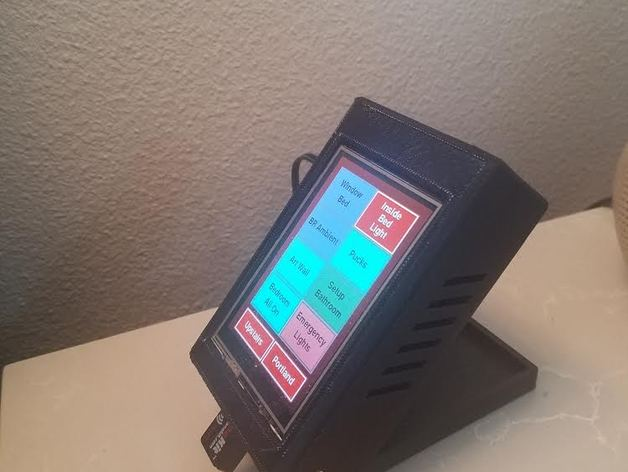

# softconsole
Uses a Raspberry Pi with any of a number of touch screens including Adafruit PiTFT, official Pi 7" screen, and Pimorni 4" scrren to create a soft touch controller a home automation system based on either an ISY-994 hub or a Home Assistant hub.  In its simplest from you can think of it as a soft replacement for various hardware based keypads to turn scenes on/off.  However, it allows defining an arbitrary number of screens of a variety of types can support multiple hubs for homes that use more than one or for multi-home controls, and supports displaying other information of interest such as current/forecase weather.  Screens are all configurable from a user supplied configuration file. For example, a Key screen can provides a screen with a number of keys a hubs devices, scenes, variables, programs, or other abstractions.  Screens can also simple display status of information from the hubs to provide simple summaries of conditions.  Scrrens are available to provide clocks, thermostat controls, etc. and various user convenience facilities such as auto-dimming when idle, brightness changes at various times of day, and idle screens that rotate various status information are available.  The code itself is modular to allow the addition of other hub types, screen types, or weather providers in a fairly straightforward manner.  Finally, for homes running multiple consoles, network management for those hubs is available from any individual hub by enablng MQTT support. 

For detailed documentation see the [useage notes](docs/useagenotes.md).

 See the jpg files above for some other images of the consoles that I run.
